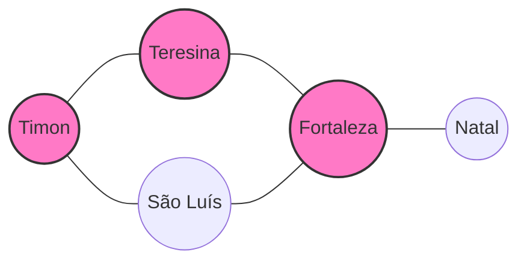
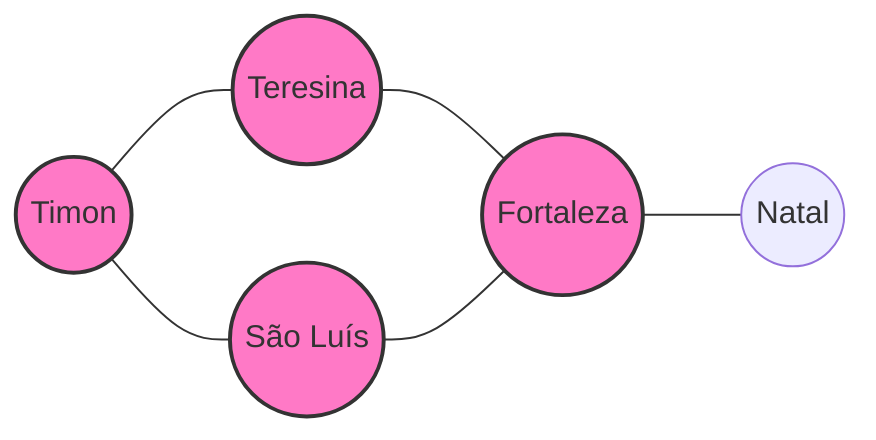
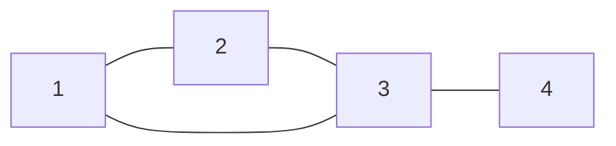
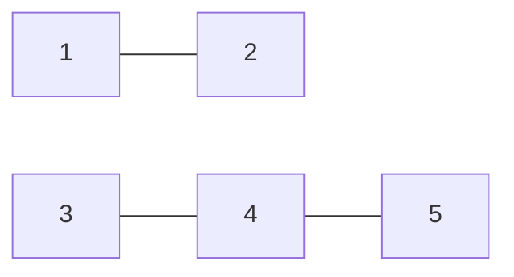
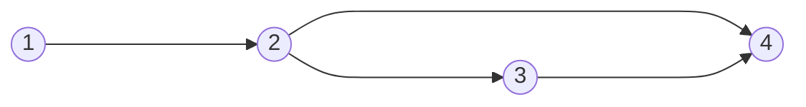
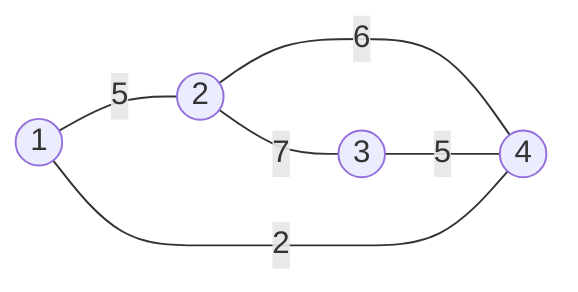

---
# try also 'default' to start simple
theme: dracula

title: Introdução a Grafos e DFS
info: |
  ## Slidev Starter Template
  Presentation slides for developers.

  Learn more at [Sli.dev](https://sli.dev)
# apply UnoCSS classes to the current slide
class: text-center
# https://sli.dev/features/drawing
drawings:
  persist: false
# slide transition: https://sli.dev/guide/animations.html#slide-transitions
transition: slide-left
# enable MDC Syntax: https://sli.dev/features/mdc
mdc: true
# duration of the presentation
duration: 35min
---

# Introdução a Grafos e DFS

<!--
The last comment block of each slide will be treated as slide notes. It will be visible and editable in Presenter Mode along with the slide. [Read more in the docs](https://sli.dev/guide/syntax.html#notes)
-->

---
layout: capa-aula
numero_aula: 6
---

---
layout: two-cols
layoutClass: gap-16
---

# Sumário da Aula

<Toc text-sm minDepth="1" maxDepth="2" columns=2  />
---

# Abstrações

<v-clicks>

A maior parte das estruturas e conceitos na computação foram criadas para resolver problemas existentes, porém muitas vezes construimos soluções utilizando soluções anteriores. Esse processo é chamado de abstração.

Por exemplo, no começo computadores conseguiam fazer contas, porém em algum momento tivemos a necessidade de ler e escrever textos nele. Sendo assim, criamos um código que define para cada caractere um valor numérico.

Se não houvesse abstração, para cada problema precisariamos pensar a nível de transistores para resolver.

Mas a aula não era de grafos?

Sim, um grafo é apenas uma estrutura que nos ajuda a abstrair um problema e transforma-lo em elementos e a relação entre os elementos.


</v-clicks>

---

# Motivação

Dado um mapa do brasil com suas estradas como armazenar essas informações num computador? Precisamos saber, onde a estrada começa, onde ela termina, bifurcações, distâncias...


Para esse problema o computador não precisa saber o tamanho ou a população da cidade, apenas quais cidades existem e quais as conexões entre elas.

---

# Transformando num grafo

<v-clicks>

Um grafo é um conjunto de vértices (bolinhas) e um conjunto de arestas (tracinhos que ligam bolinhas), é uma estrutura que se preocupa em representar elementos e a relação entre eles. Para nosso problema anterior podemos pensar num grafo assim:


Formalmente um grafo **direcionado** G é um par de conjuntos G = (V , E ), sendo V um conjunto
de vértices (bolinhas) e E um conjunto de arestas (tracinhos que ligam bolinhas). As arestas serão representadas
como um conjunto de 2 elementos.

- V = \{Timon, Teresina, Fortaleza, Natal\}
- E = \{(Timon, Teresina),(Teresina, Fortaleza),(Fortaleza, Natal)\}

</v-clicks>

---

# Caminho

Um **caminho** $P$ entre dois vértices $u$ e $v$ é uma sequência de arestas que nos permite sair de $u$ e chegar a $v$. O comprimento do caminho corresponde ao número de arestas que o compõem.

<v-clicks>



Nesse exemplo $P$ é um caminho entre Timon e Fortaleza que tem comprimento 2.

V(P) = \{Timon, Teresina, Fortaleza\}.

E(P) = \{(Timon, Teresina),(Teresina, Fortaleza)\}.


</v-clicks>

---

# Ciclos

<v-clicks>

Um caminho forma um **ciclo** se o primeiro e o último vértice forem exatamente o mesmo (isto é, o caminho começa e termina no mesmo ponto).



Nesse exemplo, podemos dizer que há um caminho de Timon até São Luis e uma aresta de volta para Timon fechando o ciclo.


</v-clicks>

---

# Conectividade

<v-clicks>

Dizemos que um grafo é **conexo** se existir um caminho entre qualquer par de vértices. Quando o grafo possui grupos de vértices isolados uns dos outros, chamamos a essas "ilhas" de **componentes conexos**.

<div class="grid grid-cols-2 gap-4">

<div>

**Grafo Conexo**



</div>

<div>

**Desconexo (2 Componentes)**



</div>

</div>

OBS: Um componente conexo tem a propriedade de ser maximal, o que significa que no segundo exemplo {3,4} não é um componente conexo, porque podemos adicionar o 5.

</v-clicks>

---

# Tipos de Grafo

<v-clicks>

Podemos ajustar a nossa abstração adicionando mais propriedades às arestas para modelar problemas complexos:

## Grafo Direcionado (Digrafo)

Num grafo direcionado, as arestas possuem um sentido definido (indicado por uma seta). Se existe uma aresta orientada de u para v, podemos mover-nos de u para v, mas não o contrário, a menos que exista outra aresta de volta.

Exemplo:


Perceba que nesse grafo nós podemos ir de 1 para 2 mas nunca conseguimos voltar, pois não existem arestas nessa direção.

</v-clicks>

---

# Tipos de Grafo

<v-clicks>

## Grafo Ponderado (com pesos)

Num grafo ponderado, cada aresta tem um valor numérico associado, chamado peso ou custo. Esse peso pode representar distâncias, custos de portagem ou tempos de viagem. Agora o custo de um caminho é definido como a soma das arestas dele.



Nesse grafo o custo do caminho $1-2-4$ é $5 + 6 = 11$.

</v-clicks>

---

# Grau

<v-clicks>

## Grafo Direcionado

O grau de um vértice $u$ é a quantidade de vértices adjacentes a ele, ou seja, a quantidade de vértices que tem uma aresta para $u$.

Muitos problemas podem ser resolvidos apenas analisando o grau dos vértices, por exemplo [Problema](https://codeforces.com/group/mzbGmMVMMp/contest/697261/problem/B)

## Grafo não Direcionado

Em grafos direcionados existe o grau de entrada, que é a quantidade de arestas que chegam no vértice e grau de saida que é a quantidade de arestas que saem desse vértice.

</v-clicks>

---

# Problema Motivador

<v-clicks>

Em uma sala com $N$ alunos numerados de 1 a N, temos $M$ relações de amizade. Uma
relação de amizade é dada na forma de um par $(i, j)$ que indica que tanto $i$ é amigo de $j$
quanto $j$ é amigo de $i$, se 2 alunos são amigos eles devem estar no mesmo time. A professora de Juquinha quer separar a sala de maneira a ter o
máximo número de times possível. Responda quantos times a professora pode formar.

[Problema](https://neps.academy/br/exercise/309)

</v-clicks>

---


# Representação

<v-clicks>

Agora que definimos alguns conceitos de grafos queremos uma forma de representa-los no computador.

Existem diferentes formas de representar grafos, cada um com seus prós e contras.

A maneira mais intuitiva para um grafo com N vértices seria criar uma matriz A de tamanho N por N e a posição $A_{ij}$ guardaria se existe uma aresta indo de $i$ para $j$ 

O problema dessa forma de representar é a complexidade ao criar a matriz a nossa complexidade de tempo e espaço fica $\mathcal{O}(N^2)$

Por esse motivo a forma mais utilizada é a **Lista de Adjacência**, nela pra cada vértice nós guardamos apenas os vértices adjacentes a ele (tem uma aresta ligando).

</v-clicks>

---

# Exemplo de código

Como ler um grafo não direcionado com $N$ vértices e $M$ arestas, arestas são dadas como um par $(u,v)$:

```cpp
    int N; cin >> N;
    vector<int> lista[N]; // um array em que cada posição é uma lista de vertices adjacentes
    int M; cin >> M; // M é a quantidade de arestas
    for(int are = 0; are < m;are++){
        int u,v; cin >> u >> v;
        lista[u].push_back(v); // adiciona v na lista de u
        lista[v].push_back(u); // adiciona u na lista de v
    }
```

No caso de um grafo com pesos, podemos representar cada elemento da lista como um par(v,w) , ou seja pra cada cara $u$ guardamos qualquer vértice $v$ adjacente a ele e o peso $w$. 
```cpp
    int N; cin >> N;
    vector<pair<int,int>> lista[N]; // um array em que cada posição é uma lista de vertices adjacentes
    int M; cin >> M; // M é a quantidade de arestas
    for(int are = 0; are < m;are++){
        int u,v,w; cin >> u >> v >> w;
        lista[u].emplace_back(v,w); // adiciona v na lista de u com peso w
        lista[v].emplace_back(u,w); // adiciona u na lista de v com peso w
    }
```

---

# DFS

Um problema comum em grafos é saber para um vertice $u$ com quem ele está conectado, dai surge a necessidade de percorrer o grafo.

O nosso primeiro algoritmo para percorrer o grafo é a **Depth-firstSearch (DFS)**, ou **busca em profundidade**.

A **DFS** (*Depth-First Search*) explora o grafo indo **o mais fundo possível** num caminho antes de retroceder.

Como não queremos visitar o mesmo vértice duas vezes e ficar num ciclo infinito, usamos um *array* de `visitados` para marcar se já fomos nesse vértice.

A escolha de para qual vertice ir é arbitrária.

---

# O que é Recursão?

<v-clicks>

Antes de explorarmos grafos, precisamos entender o conceito de **recursão**. Em programação, uma função recursiva é simplesmente uma função que **chama a si mesma**.

Para que a recursão não crie um *loop* infinito, ela precisa de dois elementos fundamentais:
1. **Caso Base:** A condição de paragem (quando a função deve parar de se chamar).
2. **Passo Recursivo:** A chamada da própria função, mas com um problema ligeiramente menor.

<div class="grid grid-cols-2 gap-8 mt-4">

<div>

**Exemplo: Fatorial ($N!$)**
O fatorial de 5 é $5 \times 4!$, que é $4 \times 3!$... até chegarmos a $1!$ ou $0!$.

```cpp 
int fatorial(int n) {
    // 1. Caso Base
    if (n <= 1) return 1; 
    // 2. Passo Recursivo
    return n * fatorial(n - 1); 
}
```

</div>

</div>

</v-clicks>

---

# Código da DFS

<v-clicks>

```cpp 
const int MAXN = 1e5 + 5;
vector<int> grafo[MAXN]; // lista de adj
bool visitado[MAXN];

void dfs(int u){
  visitado[u] = true; // marca que já visitei ele
  for(int v : grafo[u]){
      if(visitado[v]) continue; // se eu já visitei o vertice ignora ele
      dfs(v);
  }
}
```

- [Visualização Interativa](https://visualgo.net/en/dfsbfs)

A complexidade de tempo é **$\mathcal{O}(V + E)$**, pois visitamos cada vértice e cada aresta no máximo uma vez.

</v-clicks>

---

# Resolvendo problema motivador

<v-clicks>

Podemos modelar esse problema como um grafo, em que existe uma aresta de $i$ para $j$ se eles são amigos, sendo assim, 2 pessoas só não estarão no mesmo time se não existir caminho entre eles.

Como o grafo é não direcionado isso acontece quando os dois vértices estão em componentes conexas diferentes. Sendo assim para maximizar a quantidade de times temos que definir que cada time é uma componente conexa.

Como descobrir quantas componentes o meu grafo tem usando DFS? Se o vertice não está num componente, criar um para ele e colocar todo mundo que ele alcança nele.

```cpp 
int qtd_comp = 0; // quantidade de componentes
    for (int i = 1; i <= n; i++)
    {
        if (!visitado[i]) // se o vertice já foi visitado, ele já está num componente
        {
            qtd_comp++;
            dfs(i);
        }
    }
    cout << qtd_comp << endl;
```

</v-clicks>

---

# Referências

- [Documentação C++](https://cplusplus.com/)
- [Aula UFMG](https://www.youtube.com/watch?v=2AS8SbpmC7o&list=PLU2KWF7n4KZzvYwAk7h2LAx4Td0kadh-T&index=8)
- [CPH](https://usaco.guide/CPH.pdf#page=119)
- [A gentle Introduction to Graph Teory](https://medium.com/basecs/a-gentle-introduction-to-graph-theory-77969829ead8)
- [Questões CSES](https://cses.fi/problemset/task/1666)
---
src: ./pages/contatos.md
---

---
layout: end
---
# Obrigado por acompanhar a aula

 Por favor preencha o [formulário](https://forms.gle/Y7rXjvKZybMibntR6) de feedback com sugestões e críticas para a próxima aula 🙃.

<QRCode url="https://forms.gle/Y7rXjvKZybMibntR6" :size="150" />
